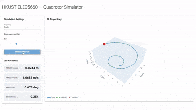
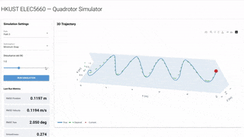
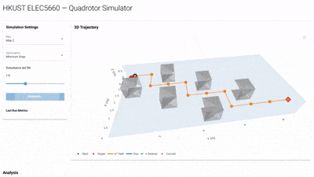
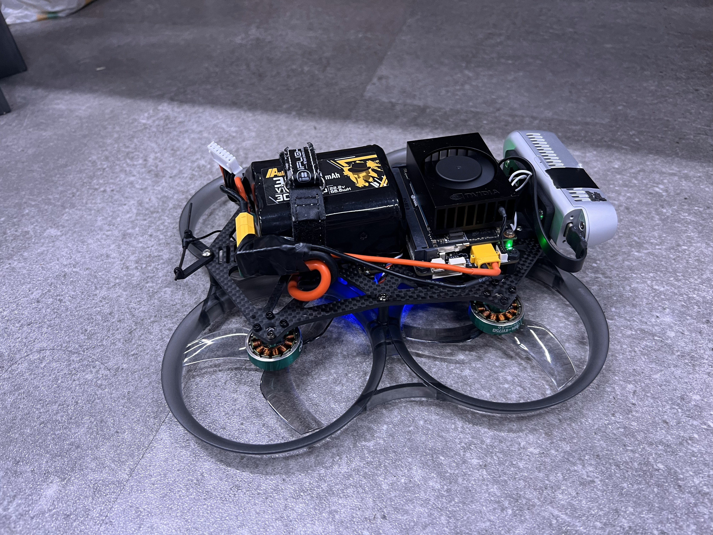
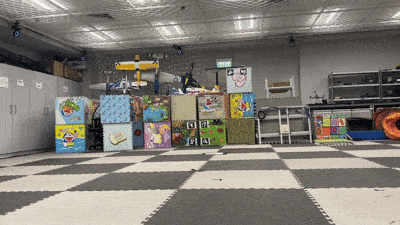
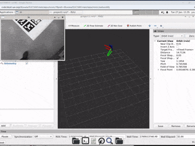
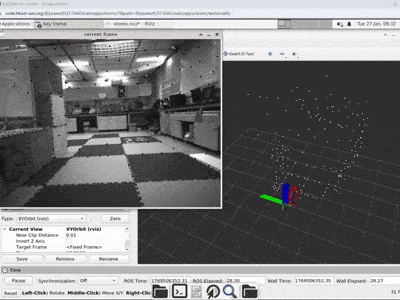
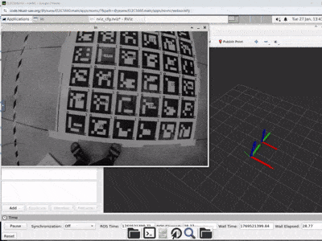
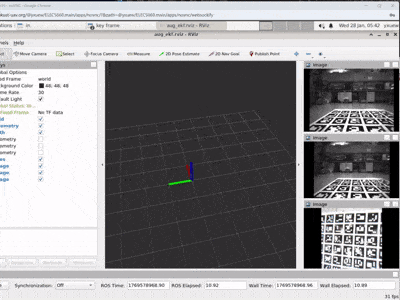
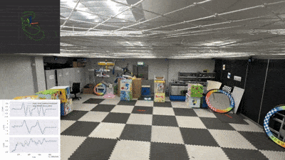

## HKUST ELEC5660: Introduction to Aerial Robotics

ELEC5660 is an HKUST PG course which gives a comprehensive introduction to aerial robots. The goal of this course is to expose students to relevant mathematical foundations and algorithms and train them to develop real-time software modules for aerial robotic systems. Topics to be covered include rigid-body dynamics, system modeling, control, trajectory planning, sensor fusion, and vision-based state estimation. Students will complete a series of projects that combine into an aerial robot that is capable of vision-based autonomous indoor navigation.

**Instructor:** [Shaojie SHEN](https://ece.hkust.edu.hk/eeshaojie)

**TAs:** [Yang Xu](https://jason-xy.cn/self/) (yxuew@connect.ust.hk), Pusen Gao (pgaoak@connect.ust.hk)

**Lab:** [HKUST Aerial Robotics Group](https://uav.ust.hk)

---

### File structure

* course_node: notes
* assignment: assignment code
* lab: lab notes
* workspace_template: Terraform template for setting up cloud workspace

### Brief description for assignments and labs

| Name | Description | Demo |
|------|-------------|------|
| proj1phase1 | Implement a basic controller for quadrotor trajectory tracking |  |
| proj1phase2 | Implement trajectory generation with minimum jerk/snap optimization |  |
| proj1phase3 | Implement A* path planning and intergrate with trajectory generation and control |  |
| lab1 | Assemble and fly a drone in manual mode and prepare hardware & software environment for later labs |  |
| proj1phase4_lab2 | Fly the drone in autonomous control mode with OptiTrack motion capture system and analyze flight data | |
| proj2phase1 | Implement Perspective-n-Point (PnP) algorithm for vision-based state estimation |  |
| proj2phase2 | Implement stereo visual odometry for 6-DOF pose estimation |  |
| proj3phase1 | Implement an Extended Kalman Filter (EKF) for sensor fusion of IMU and visual odometry |  |
| proj3phase2 | Implement an augmented EKF for sensor fusion of IMU, visual odometry, and tag-based pose estimation |  |
| proj3phase3_lab3 |  Integrate the whole system onboard for tracking trajectory or autonomous flight without OptTrack motion capture system |  |

### Contact

For questions and suggestions, please contact TAs