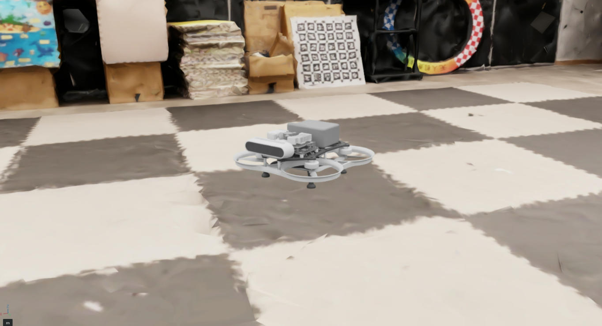
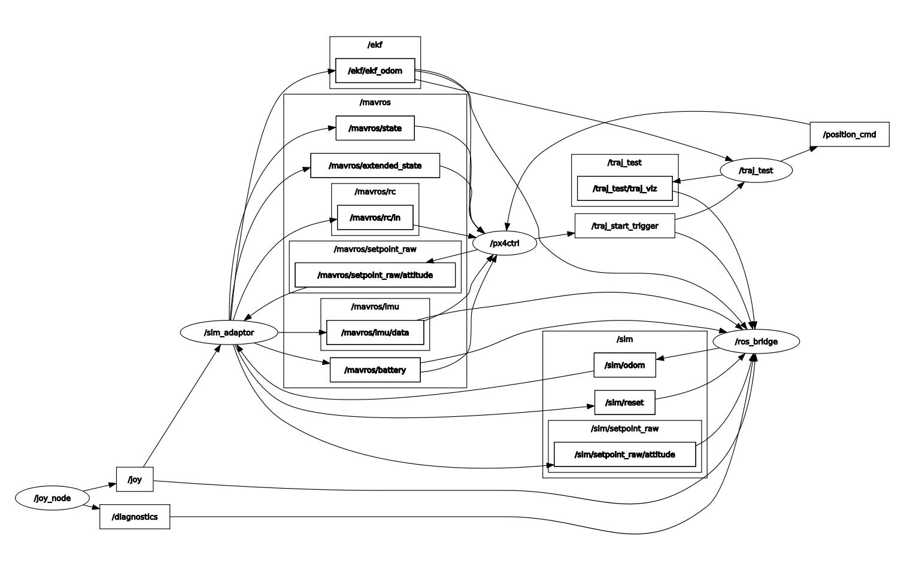

## Setup for ELEC5660 Aerial Robotics Simulator



This directory contains the code and instructions for setting up and running the aerial robotics simulator based on NVIDIA Isaac Sim. The simulator provides a realistic environment for testing and developing algorithms for aerial robots, including physics simulation, sensor simulation (IMU, stereo camera), and ROS interface.

### Prerequisites

**Host machine [requirements](https://docs.isaacsim.omniverse.nvidia.com/5.1.0/installation/requirements.html)**

| Element | Minimum Spec | Good | Ideal |
|---|---|---|---|
| OS | Ubuntu 22.04/24.04 | Ubuntu 22.04/24.04 | Ubuntu 22.04/24.04 |
| CPU | Intel Core i7 (7th Generation)<br>AMD Ryzen 5 | Intel Core i7 (9th Generation)<br>AMD Ryzen 7 | Intel Core i9, X-series or higher<br>AMD Ryzen 9, Threadripper or higher |
| Cores | 4 | 8 | 16 |
| RAM [1] | 32GB | 64GB | 64GB |
| Storage | 50GB SSD | 500GB SSD | 1TB NVMe SSD |
| GPU | GeForce RTX 4080 | GeForce RTX 5080 | RTX PRO 6000 Blackwell |
| VRAM [1] | 16GB [2] | 16GB | 48GB |
| Driver [3] | Linux: 580.65.06 | Linux: 580.65.06 | Linux: 580.65.06 |

[1] (1,2) More RAM and VRAM is recommended for advanced usage of Isaac Sim. Isaac Lab usage will require additional RAM and VRAM for training.

[2] GPUs with less than 16GB VRAM may be insufficient to run a complex scene rendering more than 16MP per frame. Consider upgrading to a higher spec if that is your use case.

[3] Isaac Sim was tested on these driver versions. See Technical Requirements for recommended driver versions.

**Peripherals**

- Xbox Controller (optional, for manual control in the simulator)

You can use your own controller by modifying the `xbox_teleop_ros1.py` and `sim_adaptor_node.py` files to match your controller's button mappings.

**Software requirements**

- Docker
- Docker Compose
- NVIDIA Container Toolkit

### Setup Instructions

**Clone the repository with Isaac Sim submodule:**

Run the `init.sh` script in the root directory of the course repository to clone the simulator submodule.

**Build & Run the simulator in docker**

```
cd lab/simulator
# This will build the docker image and start the simulator container
# The first build may take a while to prepare the docker image
./start_sim.sh --gui # This will start the simulator with GUI
```

**Build & Run our development container**

```
# In a new terminal, go to the root directory of the course repository
cd workspace_template/ELEC5660/docker
# This will build the docker image
./build.sh
# This will start the development container
./run.sh
```

Then access the container by attaching VSCode.

**Manual control with Xbox controller**
In the development container terminal, run:

```
cd <path_to_course_repo>/lab/simulator/test
python3 xbox_teleop_ros1.py
```

| Button | Function |
|--------|----------|
| RB | Control mode switch (position control / velocity control / attitude control) |
| B | Reset |
| Joystick Left/Right | Same as the real drone controller |

**Autonomous flight with ROS interface**

Add the `sim_adaptor` ros package to your catkin workspace and build it. This will mock the drone driver node (mavros) to interface with the simulator.

| Button | Function |
|--------|----------|
| RB | Control mode switch (manual / offboard) |
| LB | Auto flight start/stop |
| B | Reset |

### Details about the simulator architecture and ROS interface

**Container structure**

| Container | ROS version | Description |
|-----------|-------------| -----------|
| simulator | ROS2 | Runs NVIDIA Isaac Sim with the aerial robot model and environment |
| ros_bridge | ROS1 & ROS2 | Bridges ROS1 & ROS2 messages between simulator and dev_workspace |
| dev_workspace | ROS1 | Development workspace with ROS |

**Communication graph**

