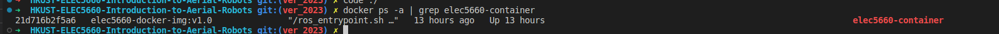

## 5660 Docker readme

5660 docker based on Ubuntu16.04 & ROS kinetic

## What is Docker

[https://www.docker.com/]()

You can view docker as a lightweight virtual machine.

You are recommended to use **vscode** for your project development; docker plug-in would enhance your developing experience !!!

## Setup your develop environment

Choose your platform and operating system to run your docker container for ELEC5660

### Windows

#### Install Docker Desktop

- Download and install Docker Desktop [https://www.docker.com/].
- After installing docker: run `docker -v` to check your installation.

#### Install VcXsrv Windows X Server

- Download and install VcXsrv [https://sourceforge.net/projects/vcxsrv/].
- Run VcXsrv step by step.
  - 
  - 
  - 

> Be sure to add the LIBGL_ALWAYS_INDIRECT variable to the operating system environment variables. Failure to do so may fail to start the GUI.
> Reference 1: https://dev.to/darksmile92/run-gui-app-in-linux-docker-container-on-windows-host-4kde
> Reference 2: https://bbs.huaweicloud.com/blogs/281862

Note: If you cannot see the GUI, you should exit VcXsrv and change the launch setting as:

- 

#### Run Docker

- Open a Powershell window with `WIN+R`, type "powershell", and press `Enter`.
- Run the following command

  ```shell
  docker run -it --volume="<files in your local mechine>:/home/workspace" -e DISPLAY=host.docker.internal:0.0 --name="elec5660-container" mortyl0834/elec5660-docker-img:v2.0 /bin/bash
  ```

  - `--volume="<dirs in your local mechine>:/home/workspace"` maps the local directory "\<dirs in your local mechine\>" to the location in docker container "/home/workspace".
  - `-e DISPLAY=host.docker.internal:0.0` specifies the port of the GUI.
  - `mortyl0834/elec5660-docker-img:v2.0` declares the docker image we are using, which will be automatically downloaded from the docker hub the first time we run it.
    example:

    ```
    docker run -it --volume="/c/usr/workspace:/home/workspace" -e DISPLAY=host.docker.internal:0.0 --name="elec5660-container" mortyl0834/elec5660-docker-img:v2.0 /bin/bash
    ```

    `/c/usr/workspace` is /usr/workspace in Disk C:/
    
    Note: The format should be similar to the above example, and the disk should use the lowercase.
    
  - `mortyl0834/elec5660-docker-img:v2.0` declares the docker image we are using, which will be automatically downloaded from the docker hub the first time we run it.
- Open a new terminal when a container is running.

  ```
  docker exec -it "<container_name>" /bin/bash
  ```
- (Optional) We recommend you to use MobaXterm to manage Windows' shells rather than Powershell. You can download it here[https://mobaxterm.mobatek.net/].

#### Validation

- Source the ROS shell via `source /opt/ros/kinetic/setup.bash`, then run `roscore` in your docker container.
- Open a new terminal, source the ROS shell, and run `rviz` to open the "Rviz" window. You will see 

#### Troubleshooting

### Ubuntu & MacOS(armv64 and x86/AMD64)

On Ubuntu simply use X11 port listen would face GPU driver issues that are hard to have a general solution. So for Ubuntu, we suggest you to run VNC listener to transfer GUI in container into web ,for more information please refer to [ROS Docker GUI](http://wiki.ros.org/docker/Tutorials/GUI)/Using VNC

#### Install Docker on Ubuntu

It is both ok to install Docker-Desktop or Docker-engine

* run `docker -v` to check your installation
  

#### Start needed docker containers and environment (VNC basing)

1. `docker network create ros`: create a Docker Network for containers to communicate with each other, create a Docker network called ros
2. run theasp/novnc container from image

   ```shell
   docker run -d --net=ros \
      --env="DISPLAY_WIDTH=3000" --env="DISPLAY_HEIGHT=1800" --env="RUN_XTERM=no" \
      --name=elec5660-novnc -p=8080:8080 \
      theasp/novnc:latest
   ```

   `docker run -d --rm`: this container will not exist after you exit the container.
   `--net=ros`:this container runs on network named **ros**(we created in step 1)
   `--env="DISPLAY_WIDTH=3000" --env="DISPLAY_HEIGHT=1800" --env="RUN_XTERM=no"`: set up environment variables
   `-p=8080:8080`: map port 8080 to localhost:8080, you can then see the GUI from web [http://localhost:8080/vnc.html
   `theasp/novnc:latest`](http://localhost:8080/vnc.html): docker image name in docker hub
   
   you should see a container names novnc when you do `docker ps -a`
3. start a roscore server container form elec5660-docker-img `docker run -d --net=ros --name elec5660-roscore mortyl0834/elec5660-docker-img:v2.0 roscore `

   
4. start container basing on elec5660-docker-img:v2.0 `docker run -it --name="elec5660-container" --volume="<files in your local mechine>:/home/workspace"  --net=ros --env="DISPLAY=elec5660-novnc:0.0" --env="ROS_MASTER_URI=http://elec5660-roscore:11311" mortyl0834/elec5660-docker-img:v2.0 bash`
   
   `--volume="<dirs in your local mechine>:/home/workspace"` maps the local directory "\<dirs in your local mechine\>" to the location in docker container "/home/workspace".
   `-net=ros --env="DISPLAY=novnc:0.0"` maps DISPLAY port to connect with novnc container
   `--env="ROS_MASTER_URI=http://roscore:11311"` tells where the roscore is running
   `mortyl0834/elec5660-docker-img:v2.0` declares the docker image we are using, which will be automatically downloaded from the docker hub the first time we run it.
5. then run rviz in container elec5660-container `rviz`
   if rviz not found, source setup script `source /opt/ros/kinetic/setup.bash` then retry rviz
   
   use a browser to visit [http://localhost:8080/vnc.html](http://localhost:8080/vnc.html) . You can now see the app's GUI

#### Validation

- Source the ROS shell via `source /opt/ros/kinetic/setup.bash`, then run `roscore` in your docker container.

## Reconnect to your develop environment

### Windows

1. use  `docker ps -a | grep elec5660-container` to check whether you have created container named elec5660-container or not
   
2. use `docker start elec5660-container` to start container
3. use `docker exec -it elec5660-container /bin/bash` to reconnect to your container

if you failed in step 1, you need to check your develop environment

### Ubuntu and MacOS

> it will be a little bit complicated

1. `docker ps -a | grep elec5660-novnc`  check whether you have created novnc container or not
2. `docker ps -a | grep elec5660-roscore` check whether you have created roscore server container or not
3. `docker ps -a | grep elec5660-container` check whether you have created elec5660 container or not
   

start all containers above

1. `docker start elec5660-novnc`  start novnc server
2. `docker start elec5660-roscore` start roscore server
3. `docker start elec5660-container` start elec5660 container

reconnect to elec5660-container

1. use `docker exec -it elec-5660-container` to reconnect to your container
2. see GUI from [http://localhost:8080/vnc.html](http://localhost:8080/vnc.html)

## Useful docker command

* `docker ps -a`: shows all the containers now in your host machine
* `docker images`: shows all the images now in your host machine
* `docker start <containter's name>` : to start existing container whose name is `<container's name>`
* `docker exec it <container's name> /bin/bash` : reconnect to the container named `<container's name>`
* once you are in the container use `exit` to quit the container, the container will stop if no one use it.
* `docker stop <container's name>`: to stop container named `<container's name>`
* `docker rm <container's name>:` to remove container named `<container's name>`

## Troubleshooting

#### LibGL error: No matching fbConfigs or visuals found


rviz coredump
